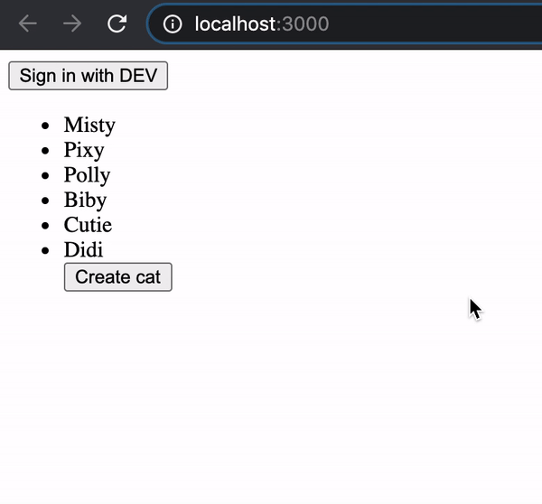

# [NestJS](https://nestjs.com/) + [NextJS](https://nextjs.org/) + [next-auth](https://next-auth.js.org/)



## Install

```
yarn
```

## Features

- clean architecture
- dependency injection using interfaces
- JWT authentication
- local dev credentials provider

## Run

```sh
export JWT_SECRET=blabla
 
cd packages/backend && yarn start
cd packages/frontend && yarn start
```
